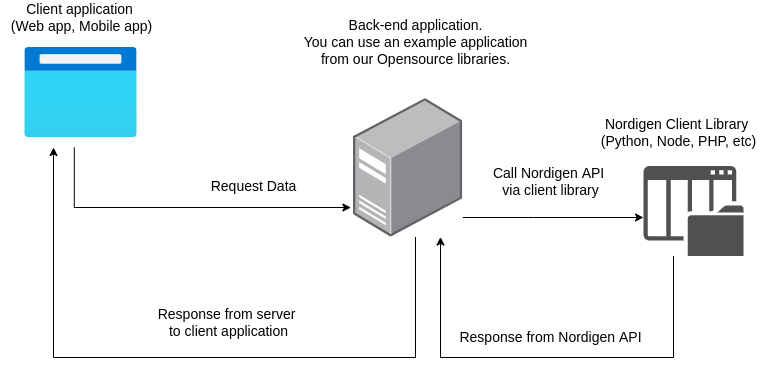

# Node application integration with Nordigen API using `Express.js`

## App architecture

Brief example of app architecture and data flow.

1. Client application ( Web app, Mobile app) makes an Http request to your  server side app, when user selects institution to which he wants to connect to. In our example we are using Node.js with `express.js` framework as our back-end solution.
2. On the server side we are using [nordigen-node](https://github.com/nordigen/nordigen-node) library to communicate with Nordigen API by calling appropriate methods to gain access to your personal finance data like `balances` and `transactions`.
3. After getting data from Nordigen API back to your server app, we can safely send this data to the client ( browser in our case ).



---

This application demonstrates how to integrate GoCardless Bank Account Data API into your back-end application and connect it with front-end using [nordigen-bank-ui library](https://github.com/nordigen/nordigen-bank-ui)

Before starting to explore example application you will need to create a new secret keys and get your `SECRET_ID` and `SECRET_KEY` from the [GoCardless Bank Account Data portal](https://bankaccountdata.gocardless.com/user-secrets/).

## Set-Up
****
1. Copy environment variables and replace with your values that you gathered from OB portal.

```sh
cp  .env.example .env
```

Another way just use `SECRETS` directly in a code by updating `NordigenClient` values in `app.js`

Example:

```js
const client = new NordigenClient({
    secretId: "YOU_SECRET_ID",
    secretKey: "YOU_SECRET_KEY"
})

* Replace `COUNTRY` environment variable in `.env` file with your desired country code in ISO format
```

2. Install dependencies

```sh
npm i
```

3. Start server `npm start` and visit url: http://localhost:3000


## Usage

1. Create account with any dummy data.
2. Connect your bank account. Note: Your data will be stored locally in SQLite database.
Your account data will be mapped with unique requisitionId and your accountId.

## Additional Notes
* Access token expires after 24 hours and needs to be refreshed manually by making `POST` request to `https://ob.gocardless.com/api/v2/token/refresh/` and updating it in `users` table. After refresh token expires, user should generate a new token using following endpoint `https://ob.gocardless.com/api/v2/token/new/`.

### Please do not use this application in Production!

## Learn more about our existing Client libraries

* [Node.js](https://github.com/nordigen/nordigen-node)
* [Python](https://github.com/nordigen/nordigen-python)
* [Ruby](https://github.com/nordigen/nordigen-ruby)
* [PHP](https://github.com/nordigen/nordigen-php)

## Have more question?

For any inquiries please contact support at [bank-account-data-support@gocardless.com](bank-account-data-support@gocardless.com) or create an issue in repository.
